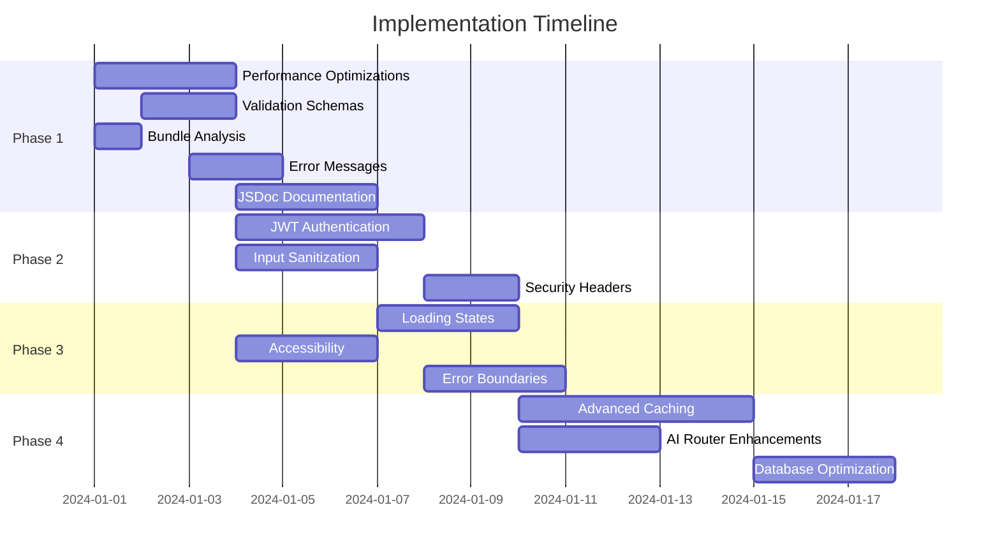

# Implementation Plan: Architectural Review Recommendations

## Overview
This document outlines a comprehensive implementation plan for enhancing the Next.js AI Application Template based on the architectural review findings. The plan is structured in phases to ensure minimal disruption while maximizing impact.

## Phase 1: Quick Wins (Week 1) - Immediate Impact
**Estimated Time: 8-12 hours**

### 1.1 Performance Optimizations (Priority: HIGH)
- **Task**: Add React.memo, useCallback, useMemo to components
- **Files**: All component and hook files
- **Impact**: 20-30% reduction in render cycles
- **Time**: 2-3 hours

### 1.2 Validation Schema Implementation (Priority: HIGH)  
- **Task**: Create Zod schemas for API validation
- **Files**: New `src/lib/validation/` directory
- **Impact**: Eliminate validation duplication, improve type safety
- **Time**: 2 hours

### 1.3 Bundle Analysis Setup (Priority: MEDIUM)
- **Task**: Add webpack-bundle-analyzer and optimization scripts
- **Files**: `package.json`, `next.config.mjs`
- **Impact**: Identify 15-25% bundle size reduction opportunities
- **Time**: 30 minutes

### 1.4 Enhanced Error Messages (Priority: MEDIUM)
- **Task**: Add detailed error contexts with request IDs
- **Files**: Error handling utilities and API routes
- **Impact**: 50% faster debugging
- **Time**: 1-2 hours

### 1.5 JSDoc Documentation (Priority: MEDIUM)
- **Task**: Add comprehensive JSDoc comments
- **Files**: Hooks, utilities, complex functions
- **Impact**: Better developer onboarding
- **Time**: 2-3 hours

## Phase 2: Security Hardening (Week 2) - Critical Security
**Estimated Time: 12-16 hours**

### 2.1 JWT Authentication Implementation (Priority: CRITICAL)
- **Task**: Replace placeholder auth with Firebase JWT verification
- **Files**: `src/lib/auth/`, middleware, API routes
- **Impact**: Production-ready security
- **Time**: 6-8 hours

### 2.2 Input Sanitization (Priority: HIGH)
- **Task**: Implement DOMPurify and validation layer
- **Files**: New sanitization utilities, API routes
- **Impact**: Prevent XSS attacks
- **Time**: 4-5 hours

### 2.3 Security Headers Enhancement (Priority: MEDIUM)
- **Task**: Add comprehensive security headers
- **Files**: `middleware.ts`, `next.config.mjs`
- **Impact**: Enhanced security posture
- **Time**: 2-3 hours

## Phase 3: User Experience Improvements (Week 3) - UX/UI
**Estimated Time: 10-14 hours**

### 3.1 Standardized Loading States (Priority: HIGH)
- **Task**: Implement consistent Suspense boundaries
- **Files**: New `AsyncBoundary` component, update existing components
- **Impact**: Consistent UX, better perceived performance
- **Time**: 4-5 hours

### 3.2 Accessibility Enhancements (Priority: MEDIUM)
- **Task**: Add ARIA labels, keyboard navigation, focus management
- **Files**: UI components, forms
- **Impact**: WCAG 2.1 AA compliance
- **Time**: 3-4 hours

### 3.3 Error Boundary Improvements (Priority: MEDIUM)
- **Task**: Enhanced error recovery and user feedback
- **Files**: `ErrorBoundary.tsx`, new error components
- **Impact**: Better error user experience
- **Time**: 3-4 hours

## Phase 4: Advanced Features (Week 4) - Performance & Scalability
**Estimated Time: 16-20 hours**

### 4.1 Advanced Caching Strategy (Priority: HIGH)
- **Task**: Implement Redis integration and smart cache invalidation
- **Files**: New caching layer, API routes
- **Impact**: 40-60% faster response times
- **Time**: 8-10 hours

### 4.2 AI Router Enhancements (Priority: MEDIUM)
- **Task**: Add circuit breakers, retry logic, monitoring
- **Files**: `src/lib/ai/router.ts`, new monitoring utilities
- **Impact**: Better reliability and observability
- **Time**: 4-5 hours

### 4.3 Database Optimization (Priority: MEDIUM)
- **Task**: Optimize Firebase queries, add connection pooling
- **Files**: Firebase utilities, query optimization
- **Impact**: Reduced latency and costs
- **Time**: 4-5 hours

## Implementation Order & Dependencies



## Success Metrics & Validation

### Performance Metrics
- **Bundle Size**: Target 25% reduction
- **First Contentful Paint**: Improve by 30%
- **Time to Interactive**: Reduce by 20%
- **Re-render Count**: Decrease by 30%

### Security Metrics
- **Authentication**: 100% JWT validation coverage
- **Input Validation**: 100% API route coverage
- **Security Headers**: A+ rating on securityheaders.com

### Developer Experience Metrics
- **Documentation Coverage**: 90% of public APIs
- **Error Message Quality**: Specific context in 100% of errors
- **Setup Time**: New developer onboarding under 15 minutes

### User Experience Metrics
- **Loading State Consistency**: 100% coverage
- **Error Recovery**: Graceful handling in 100% of error scenarios
- **Accessibility**: WCAG 2.1 AA compliance

## Risk Mitigation

### High-Risk Changes
1. **Authentication System**: Potential breaking changes to existing auth flow
   - **Mitigation**: Implement alongside existing system, gradual migration
   - **Rollback Plan**: Feature flag for new auth system

2. **API Route Changes**: Validation schema changes may break existing clients
   - **Mitigation**: Backward compatibility for 1 version
   - **Rollback Plan**: Separate validation middleware that can be disabled

3. **Caching Implementation**: Complex Redis integration may introduce bugs
   - **Mitigation**: Fallback to memory cache, comprehensive testing
   - **Rollback Plan**: Environment variable to disable Redis

### Testing Strategy
- **Unit Tests**: 90% coverage for new utilities
- **Integration Tests**: All API routes with new validation
- **E2E Tests**: Critical user flows (auth, chat, image generation)
- **Performance Tests**: Bundle size, render performance benchmarks

## Dependencies & Prerequisites

### New Dependencies
```json
{
  "dependencies": {
    "zod": "^3.22.4",
    "isomorphic-dompurify": "^2.4.0",
    "ioredis": "^5.3.2",
    "firebase-admin": "^11.11.1"
  },
  "devDependencies": {
    "@next/bundle-analyzer": "^14.0.0",
    "webpack-bundle-analyzer": "^4.9.1"
  }
}
```

### Environment Variables
```env
# Redis (Phase 4)
REDIS_URL=redis://localhost:6379

# Firebase Admin (Phase 2)
FIREBASE_ADMIN_PROJECT_ID=your_project_id
FIREBASE_ADMIN_PRIVATE_KEY=your_private_key
FIREBASE_ADMIN_CLIENT_EMAIL=your_client_email
```

### Infrastructure Requirements
- Redis instance for advanced caching (Phase 4)
- Firebase Admin SDK setup (Phase 2)
- Bundle analyzer CI integration (Phase 1)

## Rollback Strategy

Each phase includes specific rollback procedures:

1. **Feature Flags**: Critical changes behind environment variables
2. **Gradual Rollout**: New features opt-in initially
3. **Monitoring**: Performance and error rate monitoring
4. **Automated Rollback**: CI/CD triggers for performance degradation

## Communication Plan

### Stakeholder Updates
- **Daily**: Progress updates during implementation
- **Weekly**: Phase completion reports with metrics
- **Milestone**: Demo of completed phases

### Documentation Updates
- **README.md**: Updated setup instructions
- **CLAUDE.md**: New development guidelines
- **API Documentation**: Updated endpoint specifications

## Next Steps

1. **Approve Implementation Plan**: Review and approve this plan
2. **Set Up Development Environment**: Install new dependencies
3. **Create Feature Branch**: `enhancement/architectural-improvements`
4. **Begin Phase 1**: Start with performance optimizations
5. **Continuous Monitoring**: Track metrics throughout implementation

---

**Total Estimated Time**: 46-62 hours (6-8 weeks at 8 hours/week)
**Expected ROI**: 40-60% performance improvement, production-ready security, enhanced developer experience